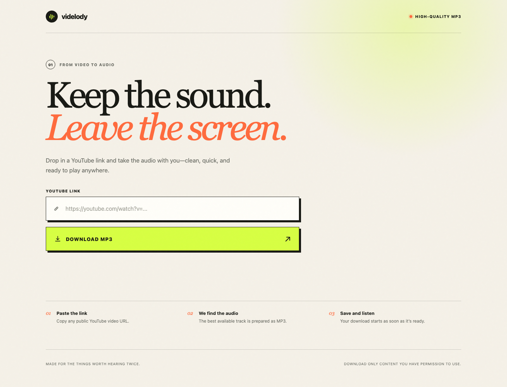

# Videlody

A small web app that turns a public YouTube video or playlist into high-quality MP3 downloads.

## Live demo

[Open Videlody](https://youtubedownloader-55me.onrender.com)

[](https://youtubedownloader-55me.onrender.com)

## Run locally

Requirements: Node.js 20+ and Python 3.9+.

```bash
npm install
npm run dev
```

Then open [http://localhost:8787](http://localhost:8787).

The app bundles FFmpeg through `ffmpeg-static`. During `npm install`, `youtube-dl-exec` installs its supported `yt-dlp` binary, so no separate media tools are needed.

## Tests

```bash
npm test
```

## Notes

- Only public HTTPS YouTube URLs are accepted.
- Playlists can contain up to 200 videos. Tracks are converted and downloaded one at a time, so keep the tab open and allow multiple downloads when your browser asks.
- Videos longer than two hours are rejected to keep resource usage bounded.
- Playlist progress is stored in memory. A Render restart or sleeping free instance interrupts the active playlist, so very long playlists may need to be started again.
- Only download content you own or have permission to use, and follow YouTube's terms and applicable law.
